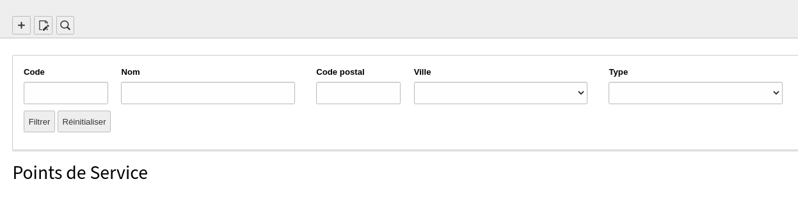

# Deploy key GitLab :

Username : gitlab+deploy-token-98

Password : vEMTWFuVGprzk-4_LoPh

# Description

Permet d'effectuer des recherches par filtres dans le backend de TYPO3.

# Usage

## En TSConfig
<pre>
lbo_backend_filters {
    filters {
        <nom de la table> {
            <nom du filtre> {
                size = <small | medium | large>
                label = <libellé du filtre>
                fieldname = <champs pour la requête dans la table>
            }
        }
    }
}
</pre>

### Exemple
<pre>
lbo_backend_filters {
    filters {
        tx_lbopointsdeservice_domain_model_pointdeservice {
            code {
                size = small
                label = Code
                fieldname = code
            }
            nom {
                size = medium
                label = Nom
                fieldname = nom
            }
            ville {
                size = medium
                label = Ville
                fieldname = ville
            }
        }
    }
}
</pre>